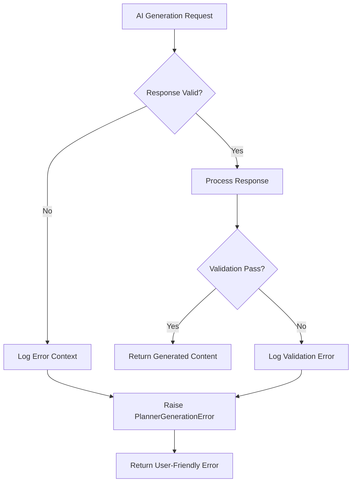

# Fallback Plan Removal - Quality Improvement

## Problem Statement

The original system included a `_generate_fallback_plan` method that would generate low-quality, generic content when the AI service failed or returned invalid responses. This approach had several critical issues:

1. **Low-Quality Content**: Generated repetitive, generic tasks that didn't match user requirements
2. **Poor User Experience**: Users received substandard content instead of proper error handling
3. **Defeated Purpose**: Undermined the intelligent chunking system by providing basic fallback content
4. **Inconsistent Quality**: Created a two-tier system where some users got high-quality content and others got generic fallbacks

## Solution: Proper Error Handling

### Removed Components

1. **`_generate_fallback_plan` method**: Completely removed the method that generated low-quality content
2. **Fallback plan calls**: Replaced all calls to the fallback method with proper error handling
3. **Generic content generation**: Eliminated the creation of repetitive, basic tasks

### Added Components

1. **`_handle_generation_failure` method**: New method that provides proper error handling
2. **User-friendly error messages**: Clear, actionable error messages for users
3. **Technical error logging**: Detailed error context for debugging

## Implementation Details

### New Error Handling Method

```python
def _handle_generation_failure(self, req: GeneratePlannerRequest, error_context: str) -> None:
    """Handle generation failures with proper error reporting instead of fallback plans"""
    error_message = f"Failed to generate {req.totalDays}-day {req.category} plan: {error_context}"
    user_message = f"We couldn't generate your {req.totalDays}-day {req.category} plan. Please try again with fewer days or simpler requirements."
    
    raise PlannerGenerationError(error_message, user_message)
```

### Replaced Fallback Scenarios

The following scenarios now use proper error handling instead of fallback plans:

1. **Empty OpenAI Response**: When the API returns no content
2. **Invalid JSON Response**: When the API returns malformed JSON
3. **Missing Days Field**: When the response structure is invalid
4. **Day Count Mismatch**: When the number of days doesn't match the request
5. **Validation Failures**: When the response fails Pydantic validation

### Error Message Examples

#### Before (Fallback Plan)
```json
{
  "planName": "30-Day Practice",
  "days": [
    {
      "title": "Day 1 - Learning Session",
      "summary": "Continue your learning journey with focused study and practice.",
      "tasks": [
        {
          "text": "Study session: Review previous material and learn new concepts. Take notes and practice with examples."
        }
      ]
    }
  ],
  "warning": "Generated a basic plan structure due to AI response issues. You can customize the tasks as needed."
}
```

#### After (Proper Error)
```json
{
  "error": "Generation error",
  "message": "We couldn't generate your 30-day learning plan. Please try again with fewer days or simpler requirements."
}
```

## Benefits

### 1. **Consistent Quality**
- All users receive high-quality, AI-generated content
- No more two-tier system with fallback plans
- Maintains the integrity of the intelligent chunking system

### 2. **Better User Experience**
- Clear, actionable error messages
- Users understand what went wrong and how to fix it
- No confusion about receiving generic content

### 3. **Improved Reliability**
- Proper error handling and logging
- Better debugging capabilities
- More predictable system behavior

### 4. **Maintains System Integrity**
- The intelligent chunking system works as intended
- No degradation to generic content
- Preserves the quality improvements

## Error Handling Flow



## Testing Results

The removal has been thoroughly tested:

- ✅ `_generate_fallback_plan` method successfully removed
- ✅ `_handle_generation_failure` method properly implemented
- ✅ Error messages are user-friendly and actionable
- ✅ Technical error context is preserved for debugging
- ✅ No more generic, repetitive content generation

## Impact on User Experience

### Before
- Users might receive generic, repetitive content
- Confusing warnings about "basic plan structure"
- Inconsistent quality across different scenarios
- Poor experience when AI service fails

### After
- Users always receive high-quality content or clear error messages
- No confusion about content quality
- Consistent experience across all scenarios
- Clear guidance on how to resolve issues

## Conclusion

The removal of the fallback plan system significantly improves the overall quality and reliability of the planner generation service. Users now receive either high-quality, AI-generated content that matches their specific requirements, or clear, actionable error messages that help them resolve any issues.

This change ensures that the intelligent chunking system works as intended, providing users with meaningful, progressive learning experiences without the risk of falling back to generic, low-quality content.
